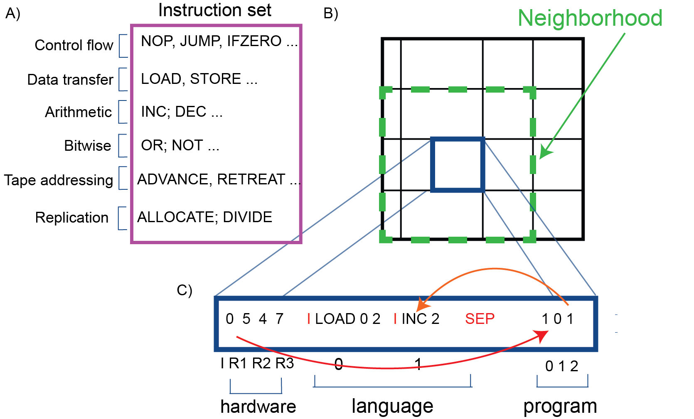

# Physax: A JAX implementation of Physis

<p align="center">
  
</p>

<p align="justify">
  <em>Illustration of the Physis framework: A) There is a fixed set of basic instructions, called opcodes, that cover different types of operations that can be performaned on a tape and registers B) The system lives on a two-dimensional grid where each cell contains a tape. At each step of the simulation a tape executes on a virtual machine. If during its execution it performs the right operations to create a copy of itself, this copy will occupy a random cell in the neighborhood of the current cell C) The tape is divided into three parts: a number indicating how many registers we have (there is always an Instruction Pointer indicating the next instruction to execute and the number of registers can vary), the language part is a set of high-level instructions (separated by the delimiter I) that are combinations of the opcodes and the program part is a set of numbers corresponding to insturctions from the language. At the beginning of the execution the IP always points to the first element in the program. .</em>
</p>

#### Installation

To install the project and set up the environment using [`uv`](https://docs.astral.sh/uv/), run:

```bash
uv venv
source .venv/bin/activate
uv sync
```

This will create a virtual environment, activate it, and install all dependencies (including PyTorch with the `cu121` setup).


### Reproducing the main experiment

The main experiment is a set of independent seeds,
each a 200k-cycle run on the `128×128` grid (`pop_size 16384`) seeded with 50
`arche.replicator` founders. Launch one process per seed (`--seed` can be any integer,
e.g. 0):

```bash
python -m physax --pop_size 16384 --initial_pop 50 --total_cycles 200000 --log_interval 50 \
    --seed 62 --wandb --track_lineage --no-caching --max_micro_ops 32 --snapshot_interval 1000

python -m physax --pop_size 16384 --initial_pop 50 --total_cycles 200000 --log_interval 50 \
    --seed 63 --wandb --track_lineage --no-caching --max_micro_ops 32 --snapshot_interval 1000
```

The simulation runs on the Numba CUDA VM backend (~3.5 h/seed) and therefore
requires a CUDA GPU. Each run preallocates a nearly-full GPU, so give each seed
its own device (`CUDA_VISIBLE_DEVICES=<gpu>`). Flag notes:
- `--no-caching` **and** `--max_micro_ops 32` keep self-replicators alive; caching-on
  and/or the default `max_micro_ops 16` cause a die-off after ~40k cycles.
- `--snapshot_interval 1000` dumps population snapshots to
  `<run>/lineage/snapshot_<cycle>.npz` (needed for the figures).

Runs land in `output/run_200000_cycles_seed_<seed>_<timestamp>/`.

